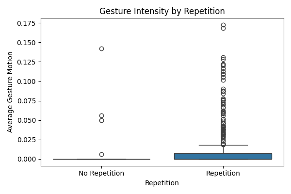

# Gesture-Language Alignment in Instructional Videos

Welcome to the Gesture-Language Alignment project! This repository explores how natural language structure predicts the intensity of physical gestures in instructional videos. It combines automatic speech transcription, pose estimation, linguistic analysis, and statistical modeling into one unified pipeline.

---

## 🧠 Project Goal

To investigate how features of spoken language — including syntactic structure, repetition, and emphasis — correlate with physical gesture intensity, using automated tools to align language and motion data from video.

---

## 📂 File Structure

```
00_videos/
├── raw_videos/                    # Original downloaded video files
├── transcripts_with_timestamps/  # Whisper-generated SRT files
├── pose_outputs/                 # MediaPipe pose JSONs
├── aligned_transcripts/          # Final JSONs with gesture + linguistic features
```

---

## 🚀 Pipeline Overview

### 1. **Download & Preprocess Videos**
- Uses `yt-dlp` to download videos
- `ffmpeg` extracts audio if needed

### 2. **Transcript Extraction**
- [`Whisper`](https://github.com/openai/whisper) transcribes audio to `.srt`

### 3. **Pose Estimation**
- [`MediaPipe`](https://developers.google.com/mediapipe) extracts 3D pose landmarks

### 4. **Alignment**
- Timestamps from the transcript are aligned to pose frames (30 FPS)
- Computes `gesture_avg` and `gesture_peak` for each segment

### 5. **Linguistic Feature Extraction**
- `spaCy` is used to extract features such as:
  - Part-of-speech counts
  - Imperative structure and type
  - Syntactic complexity (token depth, clauses, conjunctions)
  - Emphasis words, filler words, noun/pronoun ratio
  - Lemma repetition across the transcript

### 6. **Multivariate Regression Modeling**
- Uses `statsmodels` to model gesture intensity (`gesture_avg`) as a function of language features
- Includes video-level fixed effects

---

## 📊 Key Results

**Final OLS Regression Summary:**
- **Adjusted R²**: 0.195
- **Significant Predictors:**
  - `has_imperative` (**p = 0.003**) → more gesture
  - `imperative_type_procedural` (**p = 0.002**) → less gesture
  - `video_name` controls (strong individual differences)

```
                         coef    std err          t      P>|t|
---------------------------------------------------------------
has_imperative         0.0132      0.004      2.960      0.003
imperative_procedural -0.0192      0.006     -3.082      0.002
```

---

## 📈 Visualizations

### 📦 Gesture Intensity by Repetition


### 🧱 Segment-level Gesture Overlay


### 🔬 Feature Coefficient Plot *(example)*


---

## 📚 Interpretation

- **Imperative structure** is a strong predictor of gesture: procedural commands ("Add the flour") involve *less* gesture than general directives ("Look at this").
- **Speaker identity matters**: some instructional styles are more gestural.
- **Syntactic structure > surface features**: part-of-speech counts alone do not predict gesture.

---

## 🛠️ Technologies Used

- `Python 3.10`
- `spaCy` (linguistic features)
- `MediaPipe` (pose estimation)
- `OpenAI Whisper` (transcription)
- `matplotlib`, `seaborn`, `statsmodels`

---

## 📄 Citation / Attribution

If using this project or adapting it for research or a workshop submission, please cite or credit:

> Gesture-Language Alignment in Instructional Videos (2025). GitHub: [https://github.com/srt3264/Gesture-Language-Alignment-in-Instructional-Videos](https://github.com/srt3264/Gesture-Language-Alignment-in-Instructional-Videos)

---

## 🤝 Contributions & Future Work

Planned features:
- Logistic classifier for high vs. low gesture
- Expansion to more videos
- Beat/iconic gesture classification (via frame-to-frame pose changes)
- Live demo interface

Contributions welcome via issues or pull requests!

---

## 💬 Contact

For questions, collaborations, or academic reuse:
📧 [GitHub: @srt3264](https://github.com/srt3264)

---

Thanks for checking out the project! 🎥🧠🖐️